# BYD 3D Card

Advanced Home Assistant Lovelace card for BYD vehicles with a 3D-style UI, multi-language support, vehicle profiles, and category-based controls.

## Important prerequisite (required)

This card **requires** the BYD integration below.  
Without it, the BYD entities do not exist, and the card cannot show data or control the vehicle:

- https://github.com/jkaberg/hass-byd-vehicle

Recommended order:
1. Install `hass-byd-vehicle`.
2. Verify BYD entities are available in Home Assistant.
3. Install and use `BYD 3D Card`.

## Features

- 3D hero layout for vehicle image and battery status
- Vehicle profiles: `ATTO 3`, `SEAL`, `DOLPHIN`, `SEALION 7`, `ATTO 2`, `SEAL 5`, `DOLPHIN SURF`, `TANG`
- Auto entity mapping via `entity_prefix`
- Category tabs (radio style):
  - `Summary`
  - `Climate`
  - `Vehicle`
  - `Tires`
  - `Location`
  - `Quick actions`
- Drag & drop category order in UI editor
- Last selected category is remembered after refresh
- Languages: Hebrew, English, Russian, French, Catalan
- Local profile images from `pic/`
- External actions: choose multiple entities from Home Assistant and trigger them from a hero popup
- Optional unlock PIN protection with numeric keypad popup (`Enter` to confirm)
- Charging cost popup with configurable `cost per kWh`
- Charging consumption mode selector:
  - `monthly` (internal monthly tracking)
  - `sensor` (direct current sensor value)
- Hybrid profile support (`SEAL 5`, `TANG`):
  - Hero top strip:
    - Hybrid: `fuel %` + `battery %` + `range km`
    - Non-hybrid: `battery %` + `range km` (no fuel shown)
  - Summary fuel panel with progress bar (same style structure as battery bar)
  - Uses BYD integration sensor naming (`elec_percent`, `oil_percent`, `oil_endurance`)

## Install

### HACS (recommended)

1. Install from HACS as a `Dashboard` repository.
2. Add Lovelace resource (if not added automatically):
   - `/hacsfiles/<repository-name>/byd-3d-card-hacs.js`
   - Type: `module`
3. Hard refresh the browser/app.

Important:
- This repository ships `dist/` with a flat file layout (no nested folders).
- HACS downloads dashboard files from `dist/`, and nested directories are not reliably copied for this type.
- Images and language files are shipped as root files in `dist/` to ensure they are copied.

### Manual install

1. Copy `dist/` contents to:
   - `/config/www/byd-card/`
2. Add Lovelace resource:
   - URL: `/local/byd-card/byd-3d-card.js`
   - Type: `module`
3. Hard refresh the browser/app.

### If users see "resource not found" or "custom element doesn't exist"

Check these quickly:
1. Resource URL must be exactly:
   - Manual install: `/local/byd-card/byd-3d-card.js`
   - HACS install: `/hacsfiles/<repository-name>/byd-3d-card-hacs.js`
2. Resource type must be:
   - `module`
3. File must exist on HA host:
   - Manual install: `/config/www/byd-card/byd-3d-card.js`
   - HACS install: `/config/www/community/<repository-name>/byd-3d-card-hacs.js`
4. If browser/app cache is stale, add a version query:
   - `/hacsfiles/<repository-name>/byd-3d-card-hacs.js?v=1.0.16`
5. Then hard refresh the browser/app again.

## Basic YAML

```yaml
type: custom:byd-3d-card
vehicle_profile: atto3
title: Moshiko BYD ATTO 3
title_font_size: 35
entity_prefix: byd_atto_3
image_url: ""
show_tires: true
show_actions: true
show_climate: true
show_vehicle: true
show_location: true
show_charging_cost: true
charging_cost_per_kwh: 0.63
charging_cost_mode: monthly
require_unlock_pin: false
unlock_pin_code: ""
tire_pressure_unit: psi
refresh_interval_seconds: 25
language: he
category_order:
  - summary
  - climate
  - vehicle
  - tires
  - location
  - actions
custom_entities:
  - script.open_parking_gate
  - light.garden
entities: {}

```

`tire_pressure_unit` options:
- `psi`
- `kpa`

`require_unlock_pin` and `unlock_pin_code`:
- Set `require_unlock_pin: true` to require PIN verification before unlock action.
- PIN must be 4-8 digits.
- When PIN is enabled, unlock confirmation uses a numeric keypad popup (`0-9`, `Clear`, `Enter`).
- Security note: the PIN is saved in Lovelace card config, so treat dashboard edit access as sensitive.

`custom_entities`:
- Any entity IDs from any domain.
- A script icon appears on the hero image (left-bottom, aligned with lock badge).
- Tap it to open a 3-column popup grid with buttons for selected entities.
- In card editor, each selected entity can get a custom icon (for example `mdi:gate-open`).

Charging cost options:
- `show_charging_cost`: shows/hides money icon on hero image and the charging cost popup.
- `charging_cost_per_kwh`: numeric price used for cost calculation.
- `charging_cost_mode`:
  - `monthly`: tracks monthly consumed charging energy internally and resets at a new month.
  - `sensor`: uses current charging-energy sensor value directly.

Hybrid behavior:
- Hybrid fuel in top strip and summary panel is shown only for hybrid profiles (`seal5`, `tang`).
- Non-hybrid profiles keep top strip with battery/range only.
- The card prefers sensor mapping used by `jkaberg/hass-byd-vehicle`:
  - battery: `sensor.<prefix>_elec_percent`
  - fuel: `sensor.<prefix>_oil_percent`
  - fuel range fallback: `sensor.<prefix>_oil_endurance`
- If your entities differ, you can override manually in YAML:

```yaml
entities:
  battery: sensor.byd_seal_5_elec_percent
  fuel: sensor.byd_seal_5_oil_percent
  fuel_range: sensor.byd_seal_5_oil_endurance
```

## How to enable unlock PIN (step by step)

1. Open dashboard edit mode and click card `Edit`.
2. In `Categories`, enable `Require PIN before unlock`.
3. In `Vehicle unlock PIN`, enter 4-8 digits.
4. Click `Save`.
5. Test by tapping `Unlock`:
   - The popup asks confirmation.
   - Numeric keypad is shown.
   - Enter PIN and press `Enter`.

YAML equivalent:

```yaml
require_unlock_pin: true
unlock_pin_code: "1234"
```

## External actions setup (step by step)

1. Open card `Edit`.
2. In `External actions`, enable `Enable external actions`.
3. Click `Open settings`.
4. Search and add entities to the selected list.
5. Optional: set custom label and icon for each selected entity.
6. Click `Save`.
7. In the card hero area, tap the external actions icon to open the popup and run actions.

## Files

- `dist/byd-3d-card.js` - main custom card file for HACS/manual runtime
- `dist/byd-3d-card-hacs.js` - HACS-specific entry file
- `dist/*.json` - language files shipped with the card
- `dist/*.png` - profile images shipped with the card

## Profile images (in this repo)

- `pic/bydatoo3.png` - BYD ATTO 3 profile image
- `pic/byd_dolphin.png` - BYD DOLPHIN profile image
- `pic/seal.png` - BYD SEAL source profile image
- `pic/sealion.png` - BYD SEALION 7 source profile image
- `pic/byd_seal.png` - resized SEAL variant (450x273)
- `pic/byd_seal.png` - SEAL / SEAL 5 profile image
- `pic/byd_sealion7.png` - resized SEALION 7 variant (450x273)
- `pic/ATTO2.png` - BYD ATTO 2 profile image
- `pic/dolphin_surf.png` - BYD DOLPHIN SURF profile image
- `pic/TANG.png` - BYD TANG profile image

### Preview

| ATTO 3 | DOLPHIN |
|---|---|
|  |  |

| SEAL | SEALION 7 |
|---|---|
|  |  |

## UI screenshots (with explanation)

### 1) Overview + Summary


What it shows:
- Hero image + battery status badge
- Alert ribbon (single issue example)
- 6 category tabs
- Summary panel with power, range, battery bar and key metrics

### 2) Climate


What it shows:
- Climate metrics (A/C, battery heat, cabin/exterior temperatures)
- Climate controls grid (`on/off`, temp up/down, preset modes)
- Seat heating controls with level buttons
- Active service icons in hero area

### 3) Vehicle


What it shows:
- Vehicle status cards:
  - Doors
  - Windows
  - Lock
  - Online
  - Speed
  - Odometer

### 4) Quick actions


What it shows:
- Quick control buttons:
  - Lock / Unlock
  - A/C On / A/C Off
  - Battery heat
  - Flash lights
  - Find car
  - Close windows
- Active button highlighting and visual feedback

### 4.1) Unlock PIN keypad popup
Use this flow to protect unlock action with PIN:
- Enable `Require PIN before unlock` in editor
- Enter 4-8 digit PIN in `Vehicle unlock PIN`
- Unlock action opens numeric keypad popup
- Press `Enter` after typing the PIN

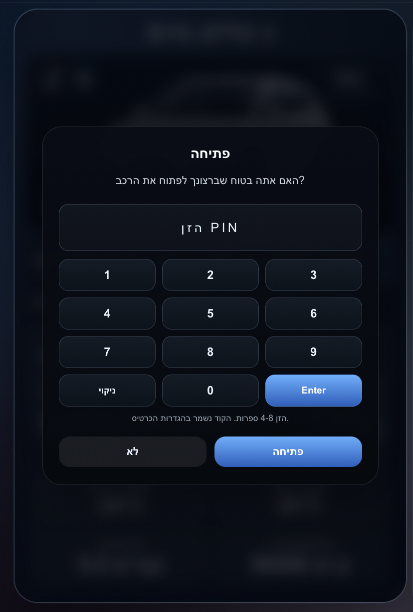

### 5) Tires


What it shows:
- Tire pressure per wheel in PSI
- Color-based status:
  - Green = normal
  - Orange = warning
  - Red = critical

### 6) Editor main view


What it shows:
- Vehicle profile selection with preview images
- Card title + title font size control
- Entity prefix
- Language picker with flags
- Live preview on the right

### 6.1) External actions + PIN options in editor
In editor you can configure:
- External actions toggle and selected entities
- Unlock PIN requirement and PIN code field

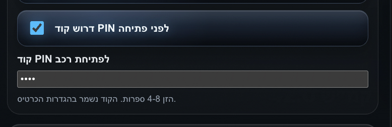
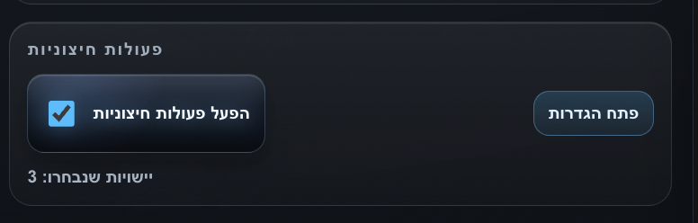
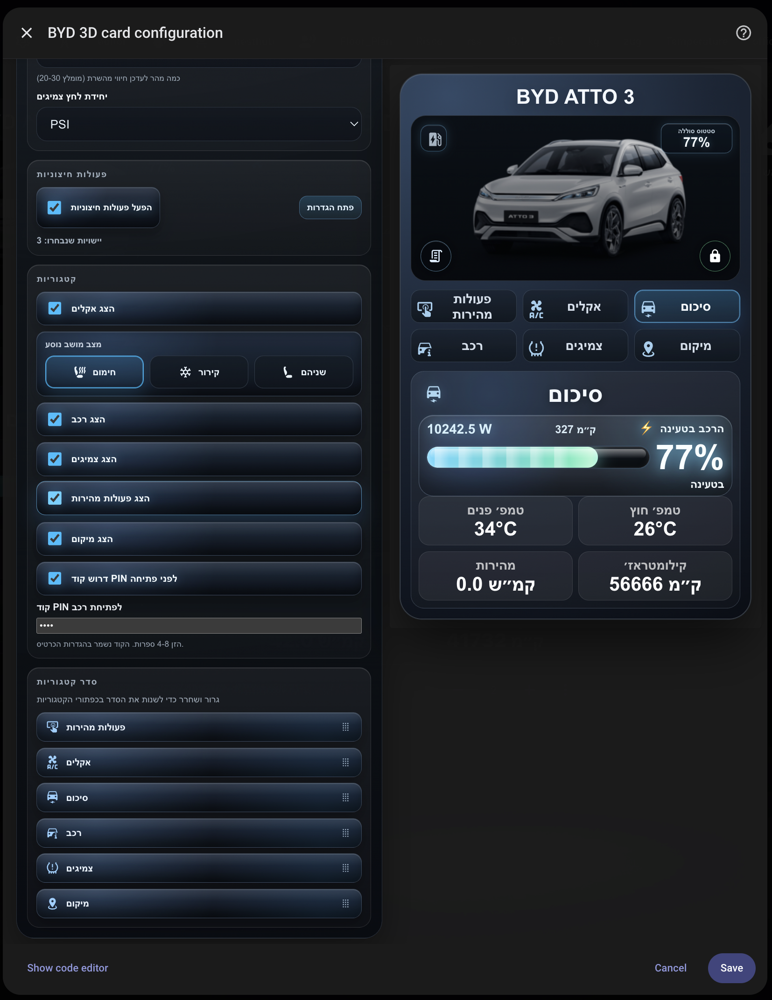
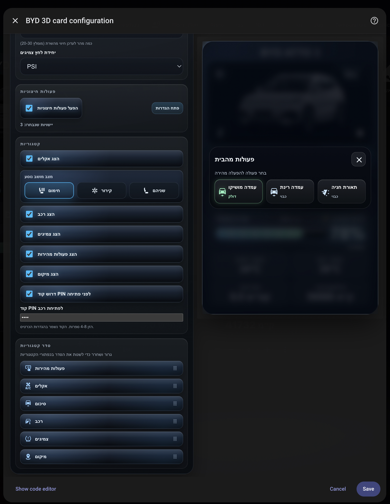

### 6.2) External actions popup
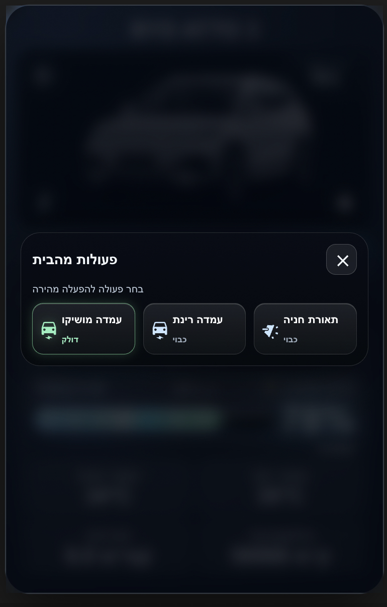

What it shows:
- The hero popup opened from the external actions icon
- Selected entities shown as quick action tiles
- Live state text under each action

### 7) Editor categories (Hebrew)


What it shows:
- Image paths and i18n path configuration
- Refresh interval setting
- Category visibility toggles
- Category order drag & drop

### 8) Editor categories (English)


What it shows:
- Full English editor labels
- Same category visibility + ordering workflow
- Live preview in English

### 9) Catalan + new vehicle profiles
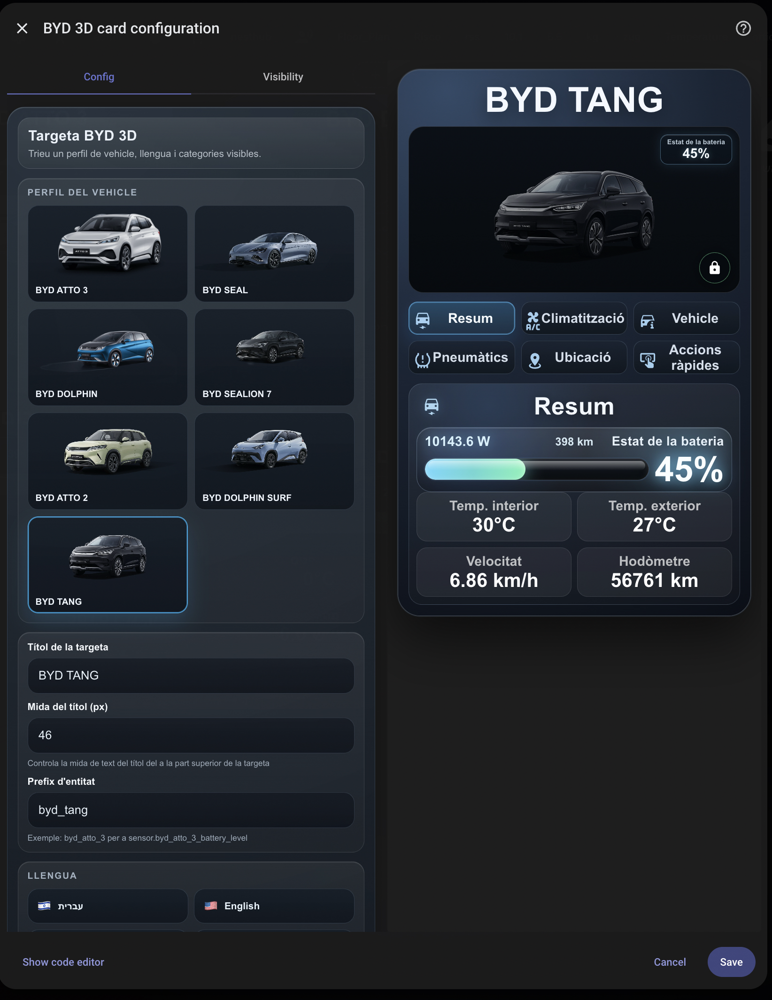

What it shows:
- Catalan (`Català`) language support in the editor
- New vehicle profiles in selection grid: `ATTO 2`, `DOLPHIN SURF`, `TANG`
- Live preview with the new `TANG` profile

### 9.1) Hybrid profile support (`SEAL 5`)
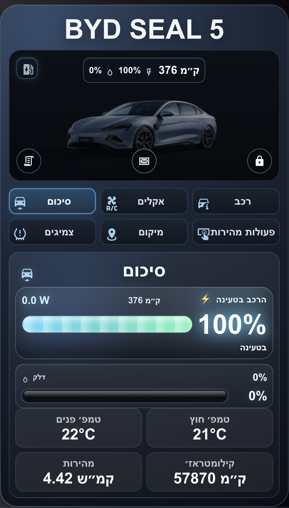

What it shows:
- Top strip behavior for hybrid profiles (`fuel %`, `battery %`, `range km`)
- Fuel panel in summary with progress bar style aligned to battery bar structure

### 10) Charging cost popup (Hebrew)
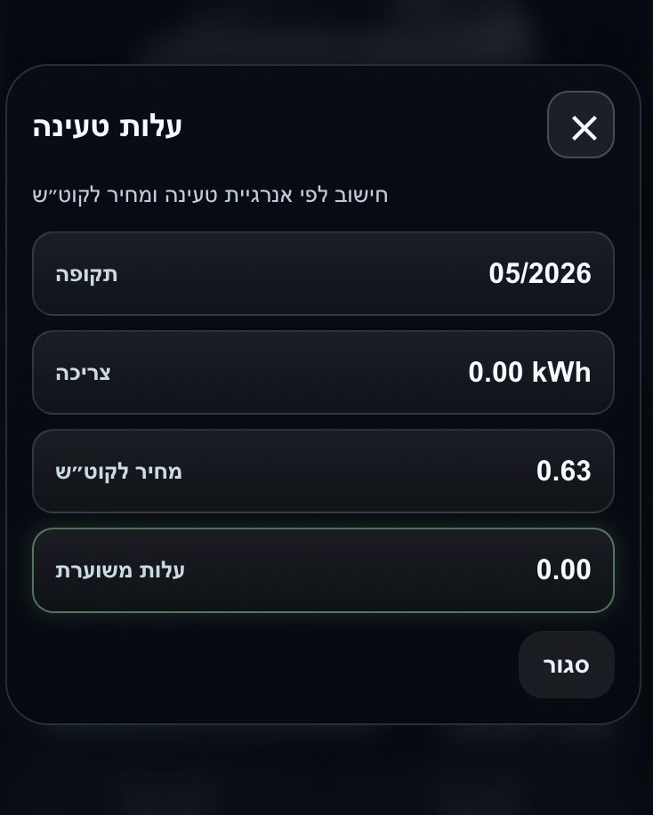

What it shows:
- Dedicated charging cost popup from hero money icon
- Monthly period display (`MM/YYYY`)
- Consumption (`kWh`), price per `kWh`, and estimated total cost

### 10.1) Charging cost settings in editor
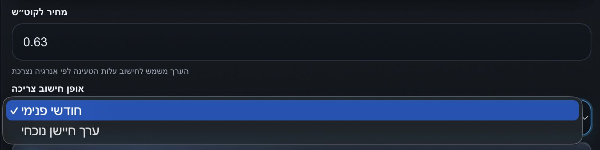

What it shows:
- Price per `kWh` input field
- Consumption mode dropdown:
  - `Internal monthly`
  - `Current sensor value`

### 10.2) Hero money icon placement
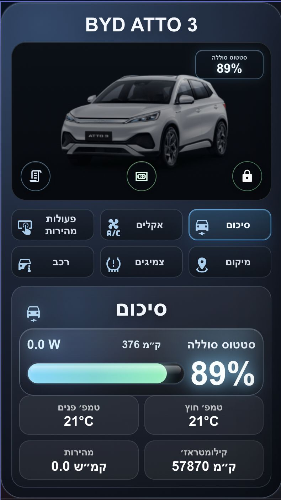

What it shows:
- Money icon positioned in hero area between external actions and lock icons
- Quick access to charging cost popup from the main dashboard view

## Notes

- `entity_prefix` example:
  - For `sensor.byd_atto_3_battery_level`, use `byd_atto_3`.
- Language files are loaded from:
  - `i18n_base_path/<language>.json`
- By default, `image_base_path` and `i18n_base_path` are auto-detected from the loaded card URL, so HACS/manual installs work without extra path config.
- If local profile image is missing, the card falls back to built-in SVG.
